# 3D printer particle scanner

## Parts List

### 3D Printer
We use the cheap open-source Creality Ender 3 3D printer as the stage

The printer **Creality Ender 3 V3** is used.

You will also need some **1.75mm PLA** filament for printing if you do not have any already.

| Part       | Supplier | Part Number            | Description                                                          | Link                                                                                                 |
|------------|----------|------------------------|----------------------------------------------------------------------|------------------------------------------------------------------------------------------------------|
| 3D Printer | Creality | Ender 3 V3             | Cheap 3D printer                                                     | https://store.creality.com/eu/products/ender-3-v3-3d-printer                                         |
| Filament   | Creality | 1kg Ender PLA Filament | PLA filament used for 3D printing                                    | https://store.creality.com/eu/products/hyper-1-75mm-pla-3d-printing-filament-1kg                     |

### Imaging system

| Part                  | Supplier      | Part Number  | Description                                                     | Link                                                                              | Image                               |
|-----------------------|---------------|--------------|-----------------------------------------------------------------|-----------------------------------------------------------------------------------|-------------------------------------|
| Camera                | Basler        | acA2440-35uc | 5MP USB3 colour machine vision camera                           | https://www.baslerweb.com/en/products/cameras/area-scan-cameras/ace/aca2440-35uc/ |
| USB Cable             | Any           | Any          | USB 3.0 cable (A Male to Micro B) for communication with camera | https://www.amazon.com/AmazonBasics-USB-3-0-Cable-Male/dp/B00NH12R1O              |
| Objective             | VS Technology | VS-TCH4-65   | 4x magnification telecentric lens                               | https://vst.co.jp/en/machine-vision-lenses-en/vs-tch-series/                      |
| Lighting              | VS Technology | VL-LR2550W   | White ring lighting                                             | https://vst.co.jp/en/lighting-en/vl-lr-series/                                    |
| Lighting Power Supply | Any           | Any          | 24V 1A power supply with 2.1mm DC plug                          | [Amazon](https://www.amazon.fr/gp/product/B09CPDTMV9?ref=ppx_pt2_dt_b_prod_image)       | 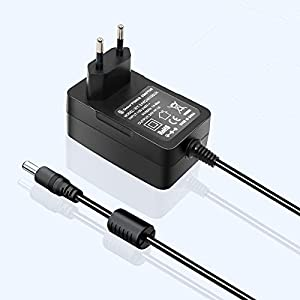   |
| Adapter               | Any           | Any          | 2.1mm DC socket to screw terminal                               | [Amazon](https://www.amazon.com/Chanzon-Female-Connector-Security-Adapter/dp/B079RCNNCK/131-3539930-8062402?pd_rd_w=3unrU&content-id=amzn1.sym.751acc83-5c05-42d0-a15e-303622651e1e&pf_rd_p=751acc83-5c05-42d0-a15e-303622651e1e&pf_rd_r=PGGYR009B31NJD7797BY&pd_rd_wg=6iLBC&pd_rd_r=4a276786-bfea-4401-9eea-cbdc9f94be1b&pd_rd_i=B079RCNNCK&psc=1) | 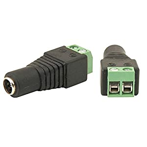 |
| Wire to 3 pin JST     | Any           | Any          | 2.1mm DC socket to screw terminal                               | [Amazon](https://www.amazon.com/BTF-LIGHTING-Connectors-WS2812B-WS2811-WS2812/dp/B01DC0KIT2?crid=2715PR4RNONUD&dib=eyJ2IjoiMSJ9.Fda-BlR8QBwHcybRwl_KB9q2H7yUl5uno08iPZgTwnn7Z9mJGFFEywnAnU9P9Co9w2Ps8xJIM4dIags-XOMMCS-K7ot--ajjUIUGXQ5xYcly4On6zGqv2-J5tv2u_1XEP9C5NRN0C942fzugqdnKVGAMo6Egaw1J9HwkJJC-HijWBzfunwFZGT_Bq8mL0xYZgPcKSiiUrEHn4ov1kkms5Fx1HnSMahyUi5ydwKYdqms.hmmKFcwTQHe2mH4f9zVjoIEXU_atk2kHlMghEuGKw4E&dib_tag=se&keywords=jst%2B3%2Bpins&qid=1747129916&sprefix=jst%2B3%2Bpins%2Caps%2C164&sr=8-3&th=1) | 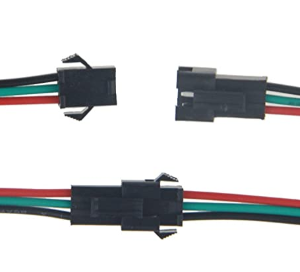     |

### Misc.

- 3 x M3 6mm bolts
- 2 x M3 10mm bolts
- 2 x M3 15mm bolts
- 3 x M3 20mm bolts
- 4 x M3 25mm bolts
- 6 x M3 nuts
- 12 x M3 washers
- 1 x M4 15mm bolt
- 1 x M4 nut

## Build Instructions

### 1. Build 3D Printer

Follow the Creality manufacturers instructions to build the 3D printer

This [youtube video](https://www.youtube.com/watch?v=x923Bkr1TwA) shows the overall process from 1:35 to 7:14.

### 2. Install Creality Print software

Download the software here https://www.creality.com/pages/download-software and install it.

### 3. Print the camera and lighting holders

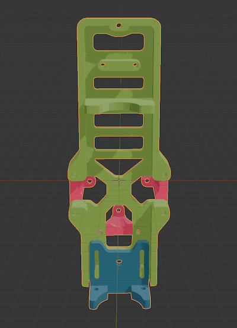

Print these parts (located in the components directory).
Depending on you light model, use the right `LightingHolder_[model].stl` file.

- 1 x CameraObjectiveHolder.stl
- 3 x Holders.stl
- 1 x LightingHolder.stl

Launch the print usiing the Creality Print software downloaded previouly. 
If the printer has been succesfully connected to the wifi network, you should be able to detect it 
with your computer and launch the print remotely.

### 4. Build the holder

Attach the 3 mounts to the holder by using 4 x M3 25mm, 2 x M3 15mm bolts and nuts:

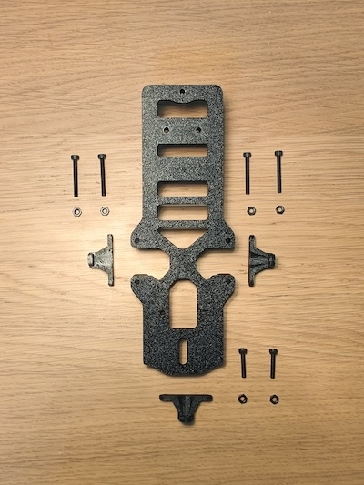 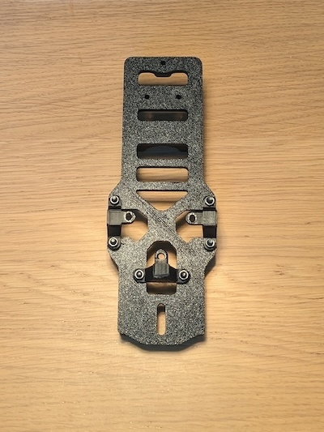

### 5. Assemble light
Attach the lighting to the lighting holder using 2 x 10mm M3 bolts and washers:

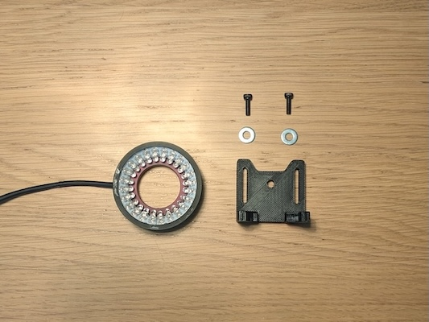 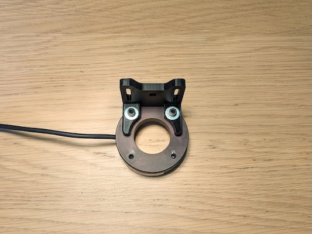

Attach the lighting holder to the camera holder using 1 x 15 mm M4 bolt and nut:

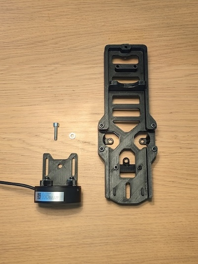 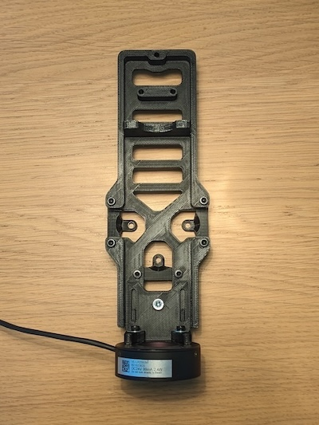

### 6. Set up the light power cable

Prepare the adaptor for the light power cable. Screw the wires from the male JST plug into the low-voltage connector ensuring that the polarity is correct. Eventually wrap the cables with some tape to protect it:

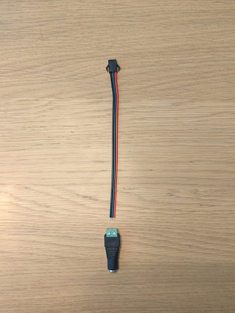
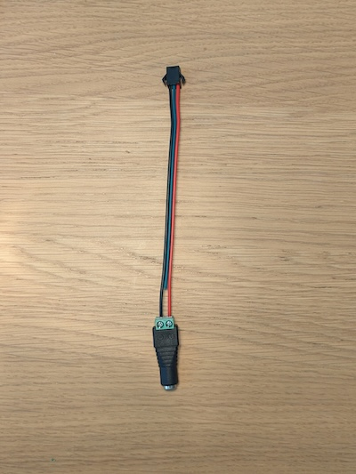
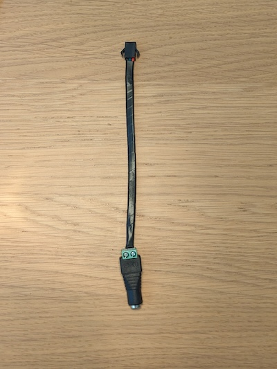

 Plug the adaptor into the 24V power supply to the adaptor. You can eventually plug the annular led light to it and turn on the power supply to make sure the lights come on.

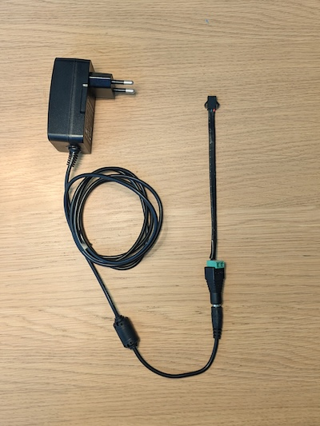
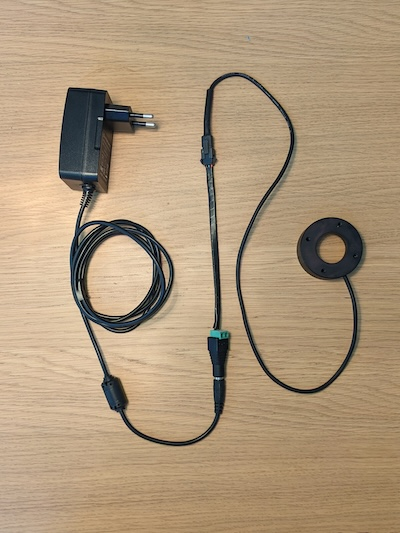

### 7. Attach holder to 3D Printer

Start by removing the front printer head. To do this, unscrew the 2 bolts on both side of the head:

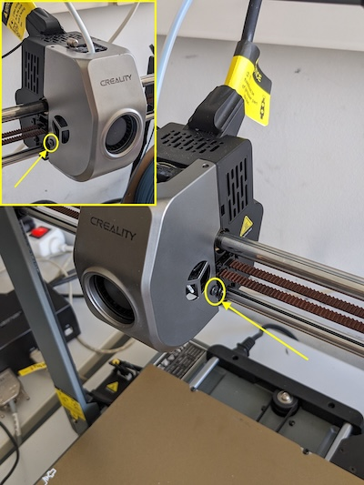

Gently lift the two parts located on the top of the front head with a flathead screwdriver to release them from the small round pegs:

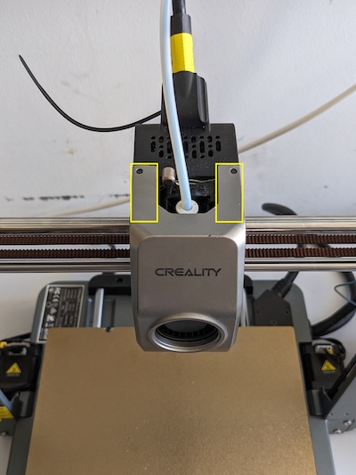
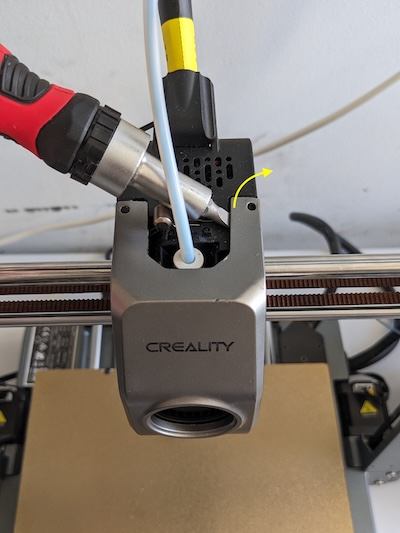
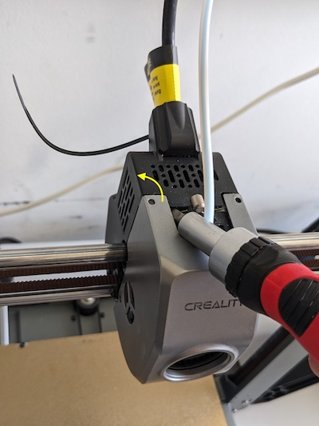

The front part of the head should now slightly come out of its mount; pull it towards you to remove it:

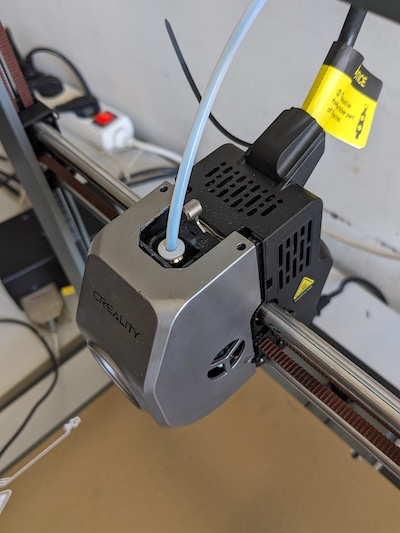

Then unplug the fan power cable, to free the front part:

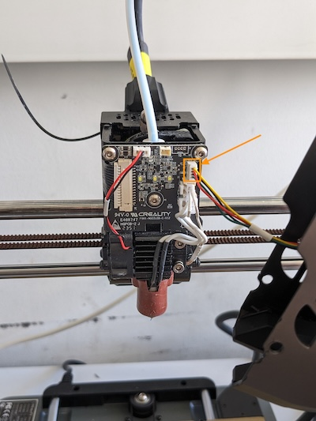

Unscrew the 3 screws holding the card and install the holder on top of it using 3 x M3 6mm bolts:

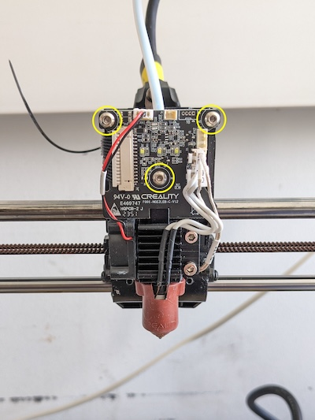
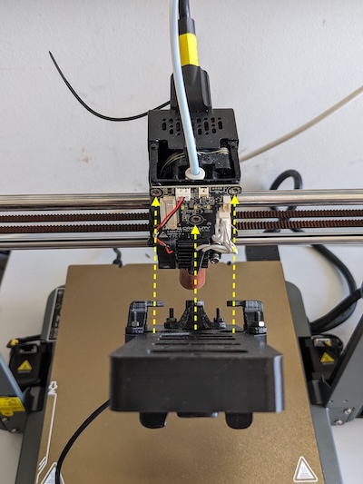
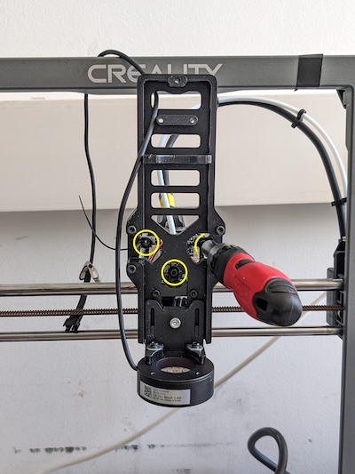

Make sure that the bottom of the ring light is not positioned lower than the print tip.

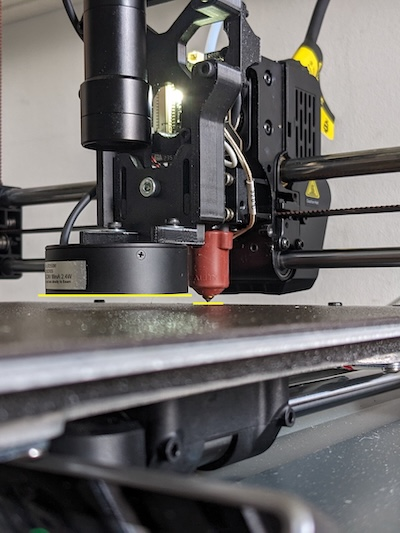

### 8. Assemble camera

Attach the camera to the camera holder using 3 x M3 20mm bolts and washers. **It is difficult to line up the angles perfectly, DO NOT FORCE IT! The bolts will screw in easily if correct.** Hint: try to do both at the same time, rather than one at a time. Once they are in, screw in all the way with fingers, then use a screwdriver for the final tighten.

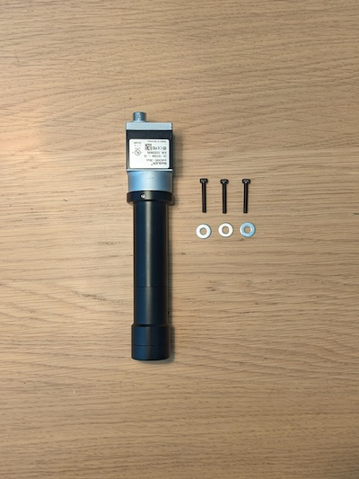 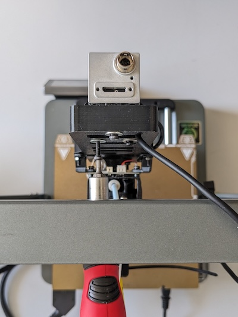

Plug the USB3 cable into the camera. Using some cable ties or wire twists, join the camera USB cable and the lighting cable together for about 50cm. Using a rubber band or tape, secure the two cables tightly to the upper-right of the frame, so that the cables make an arc. Make sure to allow enough cable length so that they don’t put any strain on the devices or the mount when the print head moves.

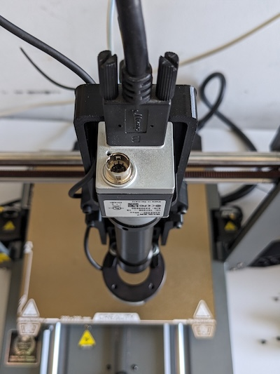
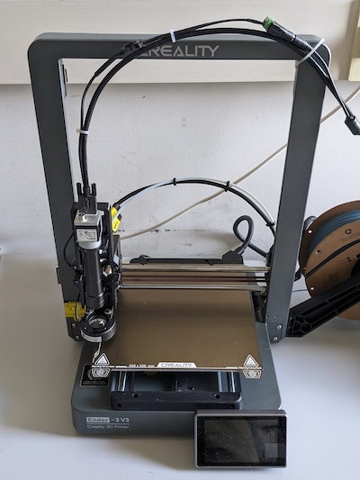

## Driver Installation

Install the [Basler Pylon Camera Software Suite](https://www.baslerweb.com/en/sales-support/downloads/software-downloads/#type=pylonsoftware;language=all;version=all). If prompted for which driver to install, select USB3.

Confirm the installation has worked by connecting the camera to your computer using the USB3 cable and running **pylon Viewer**

## Software Installation (Python)

### 1. Install Python

The software needs python 3.7 or later. The easiest way to install python is to use Anaconda.

### 2. Install Sashimi

Download this repository either using git or as a zip file.

Open a terminal inside the `python/Sashimi` directory of this repository.

Run `pip install -e .`. Using `-e` means this will install this software as a linked package inside your python installation. Whenever you update the software in this repository, the changes will automatically be available.

## Usage (Python)

### 1. Start the printer

Turn on the printer and lighting power.

### 2. Launch software

From a terminal in your python environment, run 

`python -m sashimi.cli scan --dir DIRECTORY/TO/SAVE/IMAGES`

Words preceded by `--` are options that change the behavior of sashimi. To know more about options, 
see [options](options.md).

- `--dir` sets the directory to save images in.
- `--layout` sets the keyboard layout. Only QWERTY and AZERTY are supported. AZERTY is the default

The printer will move the camera to the home location and the following window will be displayed:

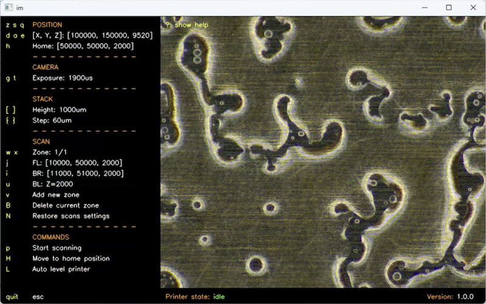

### 3. Set scan parameters

1. Create a scan region by pressing `V`. You can delete it by pressing `shift` + `B` and delete all the region by 
pressing `shift` + `N`.
2. Select the region you wish to modify by pressing `W` (previous) or `X` (next).
3. Move the camera to the front-left of the area to scan and make sure to put the background by changing the height of 
the camera. Press `J` to save the position.
4. Move the camera to the back-right of the area to scan. Again, make sure the background is in focus. Press `I` to save 
the position. 
5. Press `shift`+`U` to move automatically to the back-left corner and put the background in focus, then press `U` to 
save the height.
6. Use `[` and `]` to set the height of the stack. It is good to add a bit extra. 
7. Use `{` and `}` to set the height step of the stack. 60um is recommended for the VS-TCH4-65 lens. 
8. Use `G` and `T` to adjust the camera exposure.

> ⚠️ **Warning:** Before scanning and for every region, make sure the x and y coordinates of the back-right corner are 
> greater than those of the front-left. Otherwise, the software will not understand what to do and stop!

*Note: there are a lot of different controls that are not shown here. To know more, see [controls](controls.md).*

### 4. Start scan

Press `P` to start the scan. The progress will be displayed on screen.
Once Finished, the focus stacks will be stored in the directory in the **f-stacks** folder, sorted in sub-folders by region.

### 5. Fuse images (laplacian pyramid) 

By default, Sashimi fuses the images while scanning using Helicon-Focus. If you do not have Helicon focus, add the 
`--skip-fs` option when starting Sashimi. Once scanning is complete, from a terminal in your python environment, run 

`python -m sashimi.cli stack --dir DIRECTORY/OF/STACKED/IMAGES`
 
where `--dir` is the directory containing the individual directories for each stack. 

### 7. Fuse images (helicon) RECOMMENDED
Alternatively, if you have Helicon Focus installed but couldn't let the picture stack while scanning, you can run the 
following command :

`python -m sashimi.cli helicon-stack --dir DIRECTORY/OF/STACKED/IMAGES`

